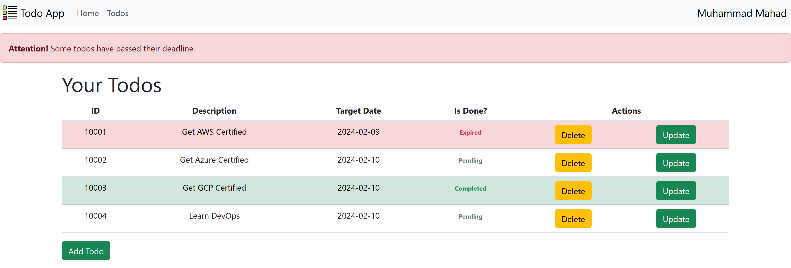
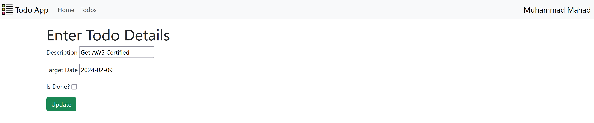
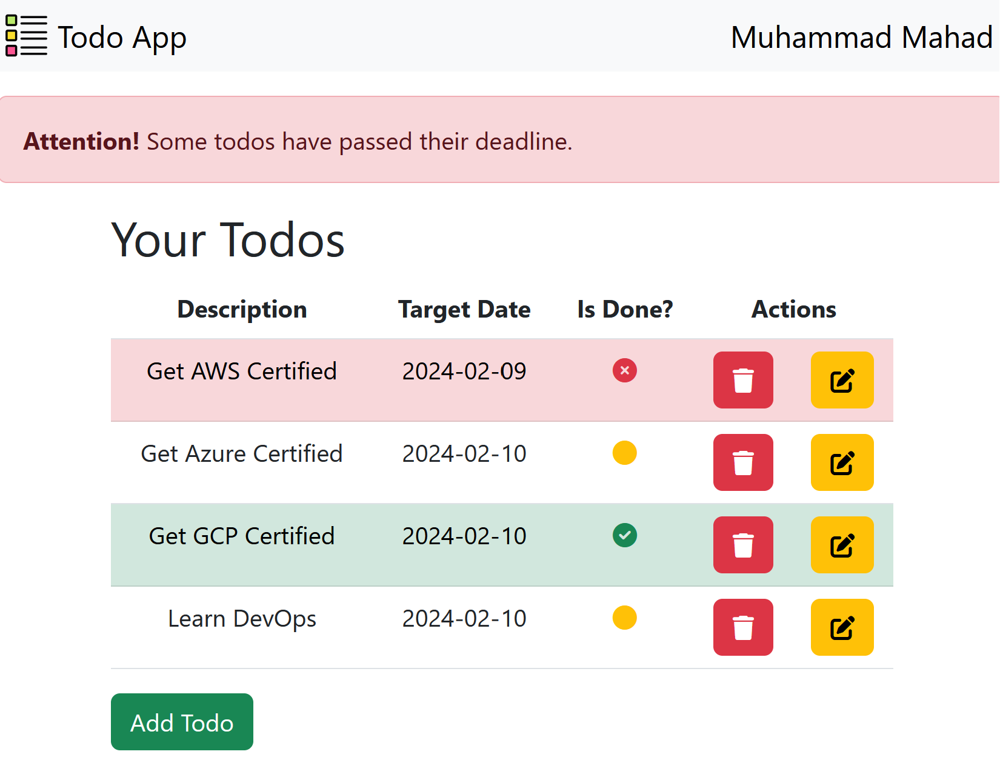

#  Spring Boot Todo App

The Spring Boot Todo App is a full-fledged CRUD (Create, Read, Update, Delete) application designed to help users manage their todos efficiently. Leveraging the power of Spring Boot and Spring Data JPA, this app seamlessly connects to a database, providing a reliable and scalable solution.

## Features

* **Add Todo:** Quickly add new todos with details like description, completion date, and status.
* **Update Todo:** Effortlessly modify existing todos, ensuring your task list is always up to date.
* **Delete Todo:** Streamlined deletion process with a confirmation step to prevent accidental removal.
* **View All Todos:** Easily browse through a comprehensive list of all your todos.

## Technologies Used

* Spring Boot
* Spring Data JPA
* Thymeleaf (for server-side templating)
* Bootstrap
* MySQL (or your preferred database)

## Getting Started

Get started with the app by cloning the repository, setting up your database configuration, and running the application. Visit [http://localhost:8080]() to access the app.

## Screenshots

### Responsive View

## Workflow

### Add Todo

1. Click on "Add Todo"
2. Fill in the details and click "Save."

### Update Todo

1. Click on "Update", the todo you want to update.
2. Modify the details and click "Update."

### Delete Todo

1. Click on "Todos" in the navigation bar.
2. Click on "Delete", the todo you want to delete.
3. Click on "Yes, Delete" and confirm the action.

## Contributing

Contributions to the project are welcome! Feel free to open issues or submit pull requests.

## License

This project is licensed under the MIT License - see the [LICENSE](LICENSE "LICENSE") file for details.

Elevate your todo management experience with the Spring Boot Todo App!
